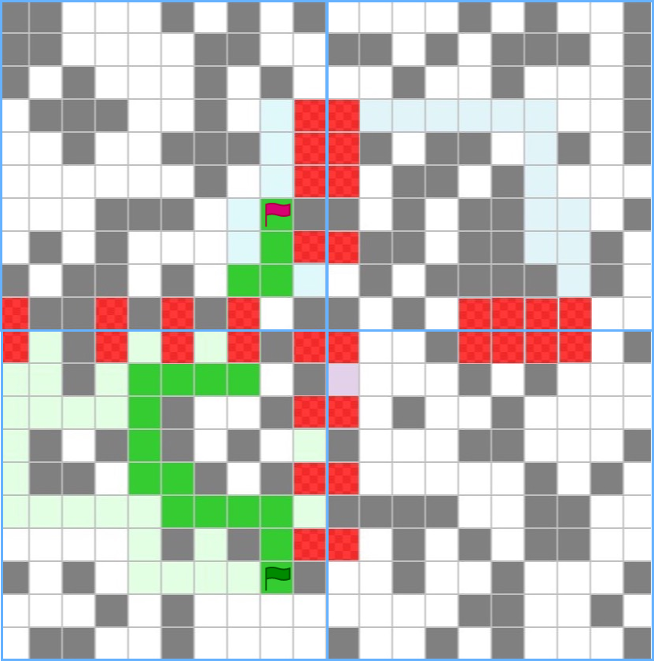

# Parallel A*

HPC Project for @University of Trento 

This parallel computing concept enables a faster computation of a path finding problem, distributing
the 2D maze to multiple processes (MPI ranks) and mapping most of all the possible paths withing each chunk.
The result gives a less optimized path but a faster computation time it's guaranteed.

Parallel distribution and communication has been handled with MPI and openMP.

It has been benchmarked on the [University of Trento](https://www.unitn.it/) HPC cluster. Full analysis available.

Report Paper [here](static%2FParallel_A_star_report_paper.pdf)
